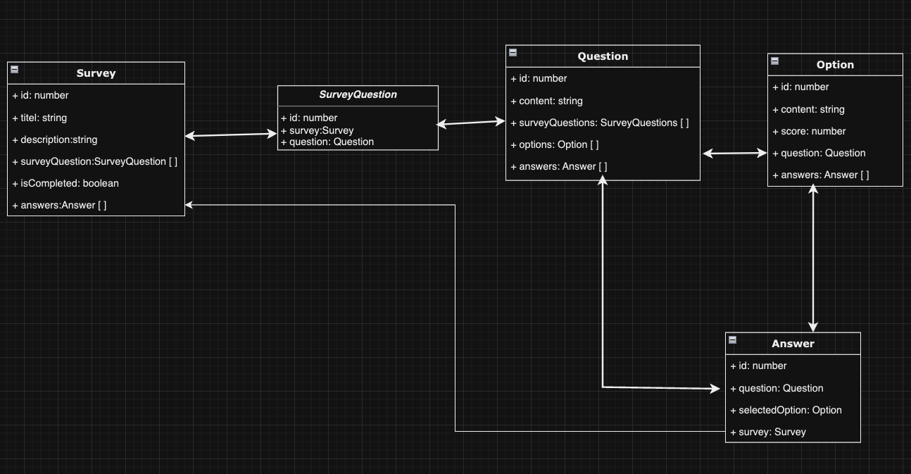

## Description

Survey API with GraphQL and NestJS

## Simple Entity Relation Diagram



익명으로 설문조사를 진행한다 가정하고 설계함

## Requirements

- Docker

- node v18.18.2

- npm v9.8.1

## Installation

```bash
$ npm install
```

## Running the app

```bash
#서버 와 DB 실행
$ make start

# 서버 엔드포인트
localhost:4000/graphql

#pgadmin 엔드포인트
localhost:5040
```

## Test

```bash
# unit tests
$ npm run test

# e2e tests
$ npm run test:e2e

# test coverage
$ npm run test:cov
```

## API Documentation

앱 실행한 후 http://localhost:4000/graphql에 접속하여 GraphQL 플레이그라운드에 액세스하고 API 문서 확인 가능
